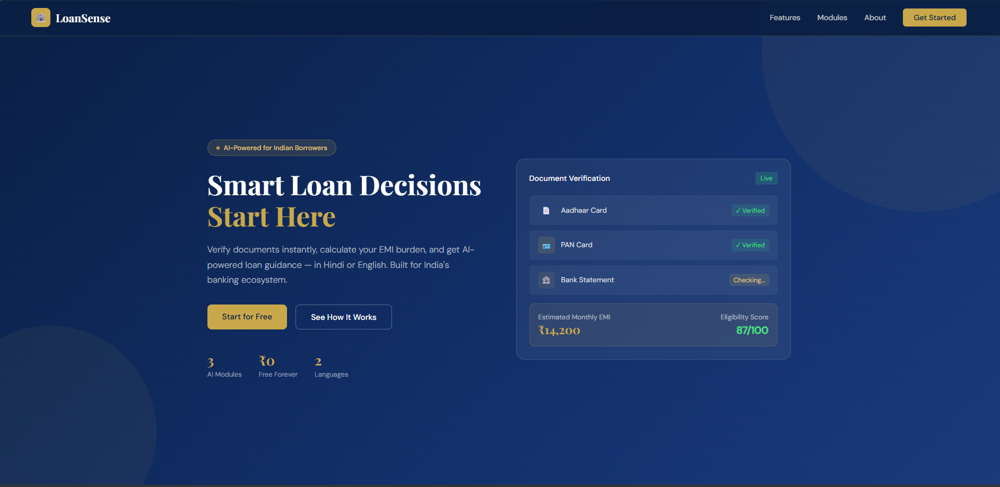
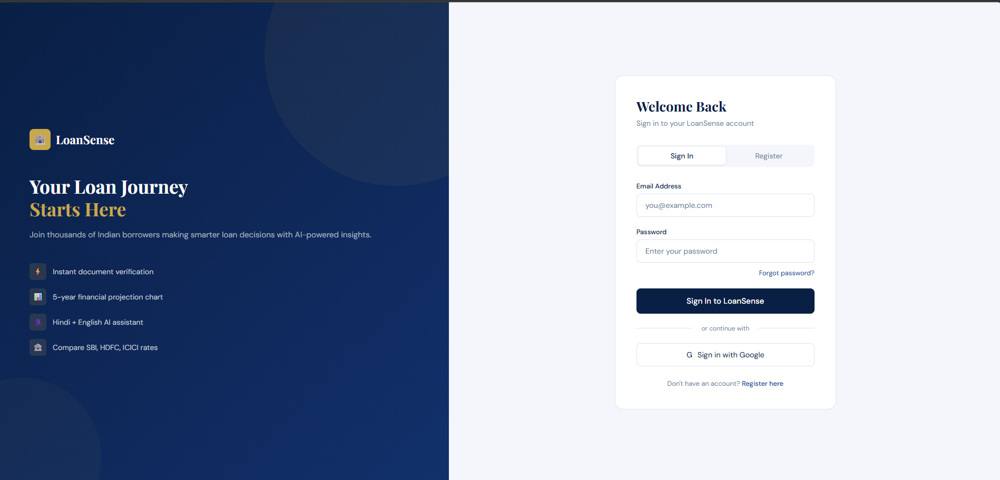

# 🏦 LoanSense — AI Loan Document Verifier & Assistant

> Built for India's borrowers — verify documents, calculate EMI, and get AI-powered loan guidance in Hindi or English.

## 🌐 Live Demo
👉 [loansense-w9f5.onrender.com](https://loansense-w9f5.onrender.com)

---

## 📸 Screenshots

### Landing Page


### Dashboard


### Bank Comparison


---

## ✨ Key Features

- 🇮🇳 **Built for India** — supports Aadhaar, PAN, Form 16 & Indian bank formats
- ⚡ **Instant red-flag detection** — flags fake/tampered documents in seconds
- 🗣️ **Hindi + English chatbot** — ask loan questions in your language
- 📊 **Visual EMI burden chart** — see your 5-year financial future at a glance
- 🏦 **Bank comparison** — compare SBI, HDFC, ICICI loan rates side by side
- 🔐 **Real authentication** — secure login with SQLite database

---

## 🧩 Modules

| Module | Description |
|--------|-------------|
| 📄 Module 1 — Document Verifier | Upload income proof, ID, bank statements → AI extracts & validates |
| 🤖 Module 2 — Loan AI Assistant | Chatbot answers eligibility, EMI & bank questions in Hindi/English |
| 📈 Module 3 — 5-Year Projection | Projects EMI burden, savings & debt-free date visually |

---

## 🛠️ Tech Stack

| Technology | Usage |
|---|---|
| Python + Flask | Backend web framework |
| SQLite + Flask-SQLAlchemy | User database |
| Google Gemini AI | Bilingual loan chatbot |
| Matplotlib | EMI projection charts |
| PyPDF2 | Document text extraction |
| HTML + CSS + JS | Frontend UI |
| Render | Cloud deployment |

---

## 🚀 Getting Started

```bash
# Clone the repo
git clone https://github.com/gunja1708/LoanSense.git
cd LoanSense

# Create virtual environment
python -m venv venv
venv\Scripts\activate  # Windows
source venv/bin/activate  # Mac/Linux

# Install dependencies
pip install -r requirements.txt

# Add your API key
echo "GEMINI_API_KEY=your-key-here" > .env

# Run the app
python app.py
```

Visit `http://127.0.0.1:5000` 🎉

---

## 📄 License

MIT License — free to use and modify.
